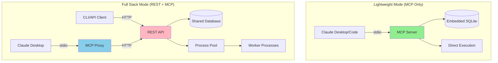

> **🔥 The most flexible fire-and-forget task execution system + prod-level MCP for Claude Code SDK**  
> Run with zero infrastructure (MCP standalone) or at scale (REST API + Workers)

[](https://www.python.org/downloads/)
[](https://modelcontextprotocol.io)
[](https://fastapi.tiangolo.com)
[](LICENSE)
[-orange.svg)](https://pypi.org/project/claude-worker/)
[](docs/00-overview.md)

## 🎯 Why Claude Worker?

**The Problem:** Claude Code tasks may take a few minutes to finish. Running them interactively in your terminal can be time-consuming. When possible, you can run tasks in parallel to save time. By using Claude Code as a CTO and running it in MCP server mode, you can execute multiple tasks simultaneously.

**The Solution:** Claude Worker provides a robust task execution system that:

- ✅ **Runs anywhere** - From lightweight CLI tools to MCP that can be used by another Claude Code
- ✅ **Never loses work** - SQLite persistence survives crashes (local, accessible DB)
- ✅ **Scales flexibly** - Process isolation with configurable workers
- ✅ **Integrates everywhere** - MCP, CLI, REST API (not documented) or programmatic

## 🏗️ Architecture: Two Modes, One Codebase



## ⚡ Quick Start

### Choose Your Path:

<table>
<tr>
<td width="30%">

### 🏢 CLI Mode
**For:** Set tasks from both CLI, flexible to add tasks by MD/TXT files or just plain text commands!

```bash
pip install "claude-worker[server]" <-  (💡 if you want both, use claude-worker[full] )
claude-worker server start
claude-worker run "Your task"
```

[→ Quick Start Guide](docs/01-getting-started-quick-start.md)

</td>
<td width="30%">

### 🪶 MCP Mode
**For:** Use 'Claude Code' as planner (CTO) and use 'Claude Code Worker' to execute tasks (dev) in parallel

```bash
pip install "claude-worker[mcp]" <-  (💡 if you want both, use claude-worker[full] )
fastmcp install claude-desktop \
  claude-worker-mcp
```

[→ Installation Guide](docs/01-getting-started-installation.md)

</td>
</tr>
</table>

---

## 📚 Documentation

Comprehensive documentation is available in the `docs/` directory:

### 🚀 Getting Started
- **[Overview](docs/00-overview.md)** - Project introduction and feature overview
- **[Installation](docs/01-getting-started-installation.md)** - Complete setup guide for all platforms
- **[Quick Start](docs/01-getting-started-quick-start.md)** - Get running in 5 minutes

### 📖 User Guides  
- **[CLI Reference](docs/02-user-guide-cli-reference.md)** - Complete command reference
- **[Task Submission](docs/02-user-guide-task-submission.md)** - Advanced submission methods (files, stdin, automation)
- **[Monitoring & Logs](docs/02-user-guide-monitoring-and-logs.md)** - Status checking and debugging

### 🏗️ Core Concepts
- **[Architecture](docs/03-concepts-architecture.md)** - System design and component overview
- **[Database Schema](docs/03-concepts-database-schema.md)** - Data model and persistence
- **[Process Model](docs/03-concepts-process-model.md)** - Task execution lifecycle
- **[Project Philosophy](docs/03-concepts-project-philosophy.md)** - Design principles and SOLE responsibility

### 🔌 Integrations
- **[REST API](docs/04-integrations-rest-api.md)** - HTTP endpoints and data models
- **[MCP for AI Agents](docs/04-integrations-mcp-for-agents.md)** - Model Context Protocol integration
- **[MCP with Claude Code](docs/04-integrations-mcp-claude-code.md)** - Error-driven prompt optimization and task delegation

### ⚙️ Administration
- **[Configuration](docs/05-administration-configuration.md)** - Environment variables and settings
- **[Deployment](docs/05-administration-deployment.md)** - Production deployment strategies
- **[Security](docs/05-administration-security.md)** - Security considerations and best practices

### 🤝 Contributing
- **[Development Setup](docs/06-contributing-development-setup.md)** - Local development environment
- **[Contribution Guide](docs/06-contributing-guide.md)** - How to contribute to the project

---

## 🚀 Installation

### Prerequisites

- **Python 3.10+** and **Node.js 16+** (for Claude Code SDK)
- **Authentication** (choose one):
  - 🔑 **Anthropic API Key** ([Get yours here](https://console.anthropic.com/))
  - 🎯 **Claude Max/Pro Subscription** (OAuth via Claude CLI - no setup needed!)

### Installation Options

```bash
# 1. MCP Tools Only (Lightweight)
pip install "claude-worker[mcp]"

# 2. REST API + CLI (No MCP) 
pip install "claude-worker[server]"

# 3. Everything (Recommended)
pip install "claude-worker[full]"

# 4. From Source (Development)
git clone https://github.com/yigitkonur/claude-worker
cd claude-worker
poetry install
```

> 📖 **Need detailed setup instructions?** See the [Installation Guide](docs/01-getting-started-installation.md)

## 🎮 Usage Examples

### MCP Mode (Claude Code Integration) 🧠

**The "CTO + Dev Team" Pattern**: Use Claude Code as the architect/planner, Claude Worker as the execution team.

```bash
# One-command installation
pip install "claude-worker[mcp]" && \
claude mcp add claude-worker -s user -- python -m claude_worker.mcp.factory

# Verify installation
claude mcp list  # Should show claude-worker ✓ Connected
```

**Smart Error-Driven Optimization** 🎯

Claude Worker uses strategic validation errors to train AI agents to write better prompts:

| Validation Rule | Purpose | Example Fix |
|-----------------|---------|-------------|
| 150+ characters | Forces detailed context | "Fix bug" → "Fix JWT expiration bug in ./src/auth/login.js by updating token validation logic" |
| Path requirement | Ensures concrete actions | "Add tests" → "Add unit tests in ./tests/auth.test.js for login functionality" |
| "Minimalist" keyword* | Enforces surgical precision | Auto-adds focus on simple, direct solutions |

*_The "John Carmack" requirement is just a [clever metaphor](https://x.com/mattshumer_/status/1921276852200477114) that works because LLMs associate it with minimal, elegant code. It's hardcoded prompt engineering, not philosophy worship!_ 😄

**Available Tools:**
- `create_task(prompt, dir, system_prompt)` - Delegate tasks with smart validation
- `get_task_status(id)` - Monitor progress with real-time updates  
- `list_tasks(limit)` - View team dashboard
- `check_api_health()` - System health check

**Example: Error-Driven Prompt Optimization**
```javascript
// ❌ This fails with helpful errors:
create_task("Add a function")
// Error: "Execution prompt must be at least 150 characters"
// Error: "Execution prompt must contain a path-like string"

// ✅ AI learns to write this instead:
create_task(
  "Create calculateTotal() function in ./src/utils/math.js that takes array of numbers and returns sum. Include JSDoc comments and unit tests in ./tests/math.test.js",
  "./my-project"
)
// Result: Precise, actionable task with clear deliverables
```

### Server Mode (CLI & API)

```bash
# Start server
claude-worker server start

# Submit tasks
claude-worker run "Create a README for my project"
claude-worker run "Refactor this code" --dir ./src --watch

# Monitor tasks
claude-worker list
claude-worker status 1
```

### Advanced Task Submission

```bash
# From files
claude-worker run prompt-template.txt --dir ./project

# From stdin (great for automation)
git diff | claude-worker run "Review these changes"
find . -name "*.py" | xargs -I {} claude-worker run "Document {}"
```

> 📖 **For comprehensive usage examples:** See [Task Submission Guide](docs/02-user-guide-task-submission.md) and [CLI Reference](docs/02-user-guide-cli-reference.md)

### REST API Usage

```python
# Python example
import httpx

client = httpx.Client(base_url="http://localhost:8000")

# Create task
task = client.post("/api/v1/tasks", json={
    "execution_prompt": "Build a todo app with FastAPI",
    "working_directory": "./project",
    "system_prompt": "You are a Python expert"
}).json()

# Check status
status = client.get(f"/api/v1/tasks/{task['id']}").json()
print(f"Task {task['id']}: {status['status']}")
```

```javascript
// JavaScript example
const response = await fetch('http://localhost:8000/api/v1/tasks', {
  method: 'POST',
  headers: { 'Content-Type': 'application/json' },
  body: JSON.stringify({
    execution_prompt: 'Build a todo app with FastAPI',
    working_directory: './project'
  })
});
const task = await response.json();
```

> 📖 **For complete API documentation:** See [REST API Reference](docs/04-integrations-rest-api.md)

## 🔧 Configuration

### 🔐 Authentication Setup

Claude Worker supports **two authentication methods** automatically:

<table>
<tr>
<td width="50%">

#### 🔑 API Key Method
```bash
export ANTHROPIC_API_KEY=your-api-key-here
claude-worker run "your task"
```
**Best for:** Teams, CI/CD, granular billing control

</td>
<td width="50%">

#### 🎯 Claude Max/Pro (OAuth)
```bash
# No setup needed! 
claude-worker run "your task"
```
**Best for:** Individual users with Claude subscription

</td>
</tr>
</table>

> 💡 **Smart Authentication:** Claude Worker automatically tries API key first, then falls back to your Claude Max subscription. No configuration needed!

### Optional Environment Variables

```bash
export CLAUDE_WORKER_DB=~/.claude-worker/tasks.db
export CLAUDE_WORKER_SERVER_URL=http://localhost:8000  # for CLI client
export CLAUDE_WORKER_LOG_DIR=~/.claude-worker/logs
```

> 📖 **For complete configuration options:** See [Configuration Guide](docs/05-administration-configuration.md)

## 🐛 Troubleshooting

### Quick Fixes for Common Issues

| Issue | Quick Fix |
|-------|-----------|
| **MCP not showing in Claude Desktop** | Restart Claude Desktop completely (Cmd+Q) |
| **Tasks stuck in "running"** | Check authentication: API key or Claude CLI login |
| **Authentication failed** | Try: `claude --version` to test Claude CLI |
| **Database lock errors** | Stop all services: `pkill -f claude-worker` |
| **Permission denied** | Fix permissions: `chmod 755 ~/.claude-worker` |

### Debug Commands

```bash
# Check system status
claude-worker server health

# Check authentication
echo $ANTHROPIC_API_KEY        # Check if API key is set
claude --version               # Test Claude CLI (for OAuth)

# View logs
tail -f ~/.claude-worker/logs/*.log

# List processes
ps aux | grep claude-worker
```

> 📖 **For detailed troubleshooting:** See [Security Guide](docs/05-administration-security.md) and check the issues on GitHub

## 🚢 Production Deployment

### Docker (Recommended)

```bash
# Quick start with Docker Compose
curl -O https://raw.githubusercontent.com/yigitkonur/claude-worker/main/docker-compose.yml
echo "ANTHROPIC_API_KEY=your-key" > .env
docker-compose up -d
```

```dockerfile
# Custom Dockerfile
FROM python:3.11-slim
WORKDIR /app
RUN pip install "claude-worker[full]"
ENV CLAUDE_WORKER_DB=/data/tasks.db
EXPOSE 8000
CMD ["claude-worker", "server", "start", "--host", "0.0.0.0"]
```

### Systemd Service

```ini
# /etc/systemd/system/claude-worker.service
[Unit]
Description=Claude Worker Server
After=network.target

[Service]
Type=exec
User=claude
WorkingDirectory=/opt/claude-worker
Environment="ANTHROPIC_API_KEY=your-key-here"
ExecStart=/usr/local/bin/claude-worker server start --host 0.0.0.0
Restart=on-failure

[Install]
WantedBy=multi-user.target
```

> 📖 **For comprehensive deployment guides:** See [Deployment Guide](docs/05-administration-deployment.md)

## 🏗️ Architecture Principles

- **🎯 SOLE Responsibility**: Each module has Single, Overarching, Lucidly-stated Expertise
- **🔒 Process Isolation**: Every task runs in its own process for safety
- **💾 Fail-Safe**: SQLite persistence ensures no work is lost
- **🔧 Extensible**: Clear interfaces for adding new features

> 📖 **Learn more about the design:** See [Project Philosophy](docs/03-concepts-project-philosophy.md) and [Architecture Overview](docs/03-concepts-architecture.md)