<h3 align="center">🗿 claude-cto 🗿 your ai coding agents' cto that gets shit done 10x faster</h3>

<p align="center">
 <strong>
    <em>your AI squad on crack: tasks run in parallel, smart waits handle dependent tasks, workflows fly on autopilot. ship code at ludicrous speed while making the vibe coding more enjoyable</em>
  </strong>

  > wanna get some sleep but still not used your Opus limit? just queue more tasks before the 5 AM reset 🐉
</p>

<p align="center">
  <!-- Package Info -->
  <a href="#"></a>
  <a href="#"></a>
  &nbsp;&nbsp;•&nbsp;&nbsp;
  <!-- Features -->
  <a href="#"></a> 
  <a href="#"></a>
</p>

<p align="center">
  
  
</p>

<div align="center">
  
### 🧭 Quick Navigation

[**⚡ Get Started**](#-get-cooking-in-60-seconds) • 
[**🎯 Real Example**](#-real-case-building-a-calorie-counter-in-minutes-wclaude-cto) • 
[**💻 CLI Dashboard**](#-your-mission-control-the-cli-dashboard) • 
[**🛠️ REST API**](#️-rest-api-your-integration-playground) • 
[**🐳 Docker**](#-deployment-options) •
[**✨ Features**](#-feature-breakdown-the-tech-sauce)

</div>

---

**`claude-cto`** is your AI dream team on steroids. stop doing that one-task-at-a-time workflow — now you've got a whole squad of ai devs (opus for the heavy stuff, sonnet for mid-tier, haiku for the easy wins) cracking code simultaneously while you sip your coffee ☕

<div align="center">
<table>
<tr>
<td align="center">
<h3>⚡</h3>
<b>10x Faster</b><br/>
<sub>Parallel execution</sub>
</td>
<td align="center">
<h3>🧠</h3>
<b>Smart AF</b><br/>
<sub>Dependency resolution</sub>
</td>
<td align="center">
<h3>🔥</h3>
<b>Never Fails</b><br/>
<sub>Auto-retries & circuit breakers</sub>
</td>
</tr>
</table>
</div>

how it slaps:  
-  you're the big-picture boss  
-  claude-cto handles the boring pm work  
-  subtle notifications keep you in the loop without killing your vibe  

---

## 💥 why claude-cto claps traditional workflows  

we've hacked the claude code sdk with that spicy `--dangerously-skip-permissions` flag to make your ai go brrrrr:  
1. cooks up a bulletproof game plan  
2. delegates like a machine  
3. handles task dependencies so smooth you'll think it's cheating  

<details open>
<summary><b>⚡ Performance Comparison: See the Difference</b></summary>

### claude-cto: advantage of parallel execution

```mermaid
graph LR
    Start[🎯 kickoff]:::start
    
    subgraph SG1["STAGE 1<br/>⏰ 4m (auth_system)"]
        S1A[setup_database<br/>3m]:::stage1
        S1B[auth_system<br/>4m]:::stage1
    end
    
    subgraph SG2["STAGE 2<br/>⏰ 5m (api_endpoints)"]
        S2A[api_endpoints<br/>5m]:::stage2
        S2B[payment_integration<br/>3m]:::stage2
        S2C[frontend_app<br/>4m]:::stage2
    end
    
    subgraph SG3["STAGE 3<br/>⏰ 2m (deploy_production)"]
        S3A[deploy_production<br/>2m]:::stage3
    end
    
    Final[🎉 launched]:::final
    Total[⏱️ 11m total<br/>4m + 5m + 2m]:::timeFast
    
    Start ==> S1A
    Start ==> S1B
    S1A ==> S2A
    S1B ==> S2A
    S1A ==> S2B
    S1B ==> S2B
    S1A ==> S2C
    S1B ==> S2C
    S2A ==> S3A
    S2B ==> S3A
    S2C ==> S3A
    S3A ==> Final
    
    classDef start fill:#7950f2,stroke:#6741d9,stroke-width:3px,color:#fff
    classDef stage1 fill:#ffd43b,stroke:#fab005,stroke-width:2px,color:#000
    classDef stage2 fill:#4dabf7,stroke:#339af0,stroke-width:2px,color:#fff
    classDef stage3 fill:#51cf66,stroke:#2f9e44,stroke-width:2px,color:#fff
    classDef final fill:#ff6b6b,stroke:#f03e3e,stroke-width:3px,color:#fff
    classDef timeFast fill:#20c997,stroke:#12b886,stroke-width:2px,color:#fff
    
    linkStyle default stroke:#51cf66,stroke-width:3px
```



### classic claude code approach: sequential execution

```mermaid
graph LR
    Start[🎯 kickoff]:::start
    S1[setup_database<br/>3m]:::stage1
    S2[auth_system<br/>4m]:::stage1
    S3[api_endpoints<br/>5m]:::stage2
    S4[payment_integration<br/>3m]:::stage2
    S5[frontend_app<br/>4m]:::stage2
    S6[deploy_production<br/>2m]:::stage3
    Final[🎉 launched]:::final
    
    Start ==> S1 ==> S2 ==> S3 ==> S4 ==> S5 ==> S6 ==> Final
    
    Total[⏱️ 21m total<br/>Sequential execution]:::timeSlow
    
    classDef start fill:#7950f2,stroke:#6741d9,stroke-width:3px,color:#fff
    classDef stage1 fill:#ffd43b,stroke:#fab005,stroke-width:2px,color:#000
    classDef stage2 fill:#4dabf7,stroke:#339af0,stroke-width:2px,color:#fff
    classDef stage3 fill:#51cf66,stroke:#2f9e44,stroke-width:2px,color:#fff
    classDef final fill:#ff6b6b,stroke:#f03e3e,stroke-width:3px,color:#fff
    classDef timeSlow fill:#ffa94d,stroke:#fd7e14,stroke-width:2px,color:#000
    
    linkStyle default stroke:#51cf66,stroke-width:3px
```



</details>

<table align="center">
<tr>
<td align="center"><b>❌ Old Way</b><br/><sub>Sequential = Slow</sub></td>
<td align="center"><b>✅ With claude-cto</b><br/><sub>Parallel = Fast AF</sub></td>
</tr>
<tr>
<td>

```
21 minutes of pain
task1 → task2 → task3 → task4
```

</td>
<td>

```
11 minutes of glory
task1 ⟶
task2 ⟶ } → task4
task3 ⟶
```

</td>
</tr>
</table>

---

## 🧠 let your AI be the CTO - the real power move

this is where shit gets wild. instead of micromanaging like some middle manager, you let claude wear the cto hat. drop a high-level goal and watch it use `claude-cto`'s toolkit to plan, delegate, and execute like a boss.

### the mcp tool belt 🧰

<details>
<summary><b>📚 Available MCP Tools (click to expand)</b></summary>

once installed, claude gets these shiny new toys to whip your ai team into shape:

| tool | what it does |
| :---: | :--- |
| **`create_task`**<br/>🚀 | **delegate like a pro**: assigns jobs to ai workers with optional dependencies |
| **`submit_orchestration`**<br/>🏁 | **the big red button**: launches entire task groups in one go |
| **`get_task_status`**<br/>📊 | **spy mode**: checks up on a single worker's progress |
| **`list_tasks`**<br/>📋 | **mission control**: shows what the whole squad's cooking |
| **`check_api_health`**<br/>❤️ | **pulse check**: makes sure the engine's purring |

</details>

---

# 📸 real case: building a calorie counter in minutes w/claude-cto

watch how claude architects a photo-to-calories app like a 10x engineer on red bull.

## you drop the mic:
> "yo, need a mobile app that identifies food from photos and tracks calories. full AI integration, slick UI, the works. make it happen."

## claude's game plan (internal monologue):

<details>
<summary><b>🧠 Claude's Master Plan (click to see the strategy)</b></summary>

> "aight bet. this is a classic waterfall-but-make-it-parallel situation:
>
> 1. **phase 1 (laying groundwork)**: app scaffold + database + AI research all go brrr at once
> 2. **phase 2 (the magic)**: camera + food recognition + nutrition math run parallel where deps allow
> 3. **phase 3 (make it pretty)**: UI + manual entry + analytics dashboard spawn when ready
> 4. **phase 4 (ship it)**: tests then optimization - can't polish what ain't built
>
> tagging this whole circus as `calorie_counter` crew."

```mermaid
graph TD
    subgraph "🌱 Phase 1: Foundation (parallel)"
        A[📱 setup_mobile_app]:::phase1
        B[🗄️ design_database]:::phase1
        C[🔍 research_ai_apis]:::phase1
    end
    subgraph "🏗️ Phase 2: Core Features (parallel)"
        D[📷 camera_module]:::phase2
        E[🤖 food_recognition]:::phase2
        F[🧮 nutrition_engine]:::phase2
    end
    subgraph "✨ Phase 3: User Experience (parallel)"
        G[🎨 ui_screens]:::phase3
        H[✏️ manual_entry]:::phase3
        I[📊 analytics_dashboard]:::phase3
    end
    subgraph "🚀 Phase 4: Launch Ready"
        J[🧪 testing_suite]:::phase4
        K[⚡ app_optimization]:::phase4
    end
    A --> D
    A --> G
    B --> F
    B --> I
    C --> E
    D --> E
    E --> F
    F --> G
    F --> H
    G --> J
    H --> J
    I --> J
    J --> K
    classDef phase1 fill:#FF6B6B,stroke:#C92A2A,color:#fff
    classDef phase2 fill:#4ECDC4,stroke:#15AAA0,color:#fff
    classDef phase3 fill:#45B7D1,stroke:#2196F3,color:#fff
    classDef phase4 fill:#96CEB4,stroke:#4CAF50,color:#fff
```



</details>

## claude starts delegating (`create_task` calls):

<details>
<summary><b>📱 Phase 1: Foundation Setup (parallel ops)</b></summary>

```python
# Claude's Tool Call:
create_task(
    task_identifier="foundation_setup",
    orchestration_group="calorie_counter",
    execution_prompt="""
    Task A: React Native TypeScript Initialize → [1]Run npx react-native init SnapCalories --template react-native-template-typescript, create /src with subdirs: /screens, /components, /services, /db, /utils, /store, /navigation, /types → [2]Install core: yarn add @react-navigation/native @react-navigation/bottom-tabs @reduxjs/toolkit react-redux redux-persist @react-native-async-storage/async-storage react-native-screens react-native-safe-area-context → [3]Configure tsconfig.json with "strict": true, paths: {"@screens/*": ["src/screens/*"], "@components/*": ["src/components/*"]}, setup .prettierrc with singleQuote, no semicolons → (Review: yarn start launches Metro, TypeScript compiles without errors|Retest: Import @screens/Home works|Fail→[2])
    Task B: Navigation Redux Store Setup → [1]Create /src/navigation/AppNavigator.tsx with createBottomTabNavigator containing 5 tabs: HomeScreen, SearchScreen, CameraScreen, HistoryScreen, ProfileScreen with icons from react-native-vector-icons/Ionicons → [2]Setup Redux in /src/store/index.ts: configureStore with userSlice (name, goals, preferences), mealsSlice (recent, favorites), persistConfig whitelist: ['user', 'preferences'] → [3]Wrap App.tsx with Provider and PersistGate, create placeholder screens that display their name, verify tab navigation works → (Review: All 5 tabs navigate correctly, Redux DevTools shows state|Retest: Kill app, reopen, user preferences persist|Fail→[2]) [Req: Task A]
    """,
    model="sonnet"
)

# Claude's Tool Call:
create_task(
    task_identifier="database_schema",
    orchestration_group="calorie_counter",
    execution_prompt="""
    Task C: SQLite Database Schema Implementation → [1]Install react-native-sqlite-storage, create /src/db/schema.ts with tables: users(id TEXT PRIMARY KEY, email TEXT UNIQUE, goals_json TEXT, created_at INTEGER), meals(id TEXT, user_id TEXT, type TEXT, logged_at INTEGER, total_calories REAL, photo_path TEXT) → [2]Add food_items(id TEXT, meal_id TEXT, name TEXT, quantity REAL, unit TEXT, calories REAL, protein REAL, carbs REAL, fat REAL), food_database(id TEXT, name TEXT, brand TEXT, barcode TEXT UNIQUE, calories REAL, protein REAL, carbs REAL, fat REAL) → [3]Create DatabaseService class with init(), executeSql(), methods for createTables(), dropTables(), verify tables exist with SELECT name FROM sqlite_master → (Review: All 4 tables created successfully|Retest: Insert and retrieve test meal|Fail→[1]) [Req: Task A]
    Task D: Database Seed Indexes Migrations → [1]Create /src/db/seeds/foods.json with 5000 USDA foods: each having name, calories, protein, carbs, fat, serving_size, import with transaction INSERT OR IGNORE → [2]Add indexes: CREATE INDEX idx_meals_date ON meals(user_id, logged_at DESC); CREATE INDEX idx_food_name ON food_database(name); CREATE INDEX idx_barcode ON food_database(barcode) → [3]Implement migration system: migrations table tracking version, up/down functions, test by adding test column then rolling back → (Review: SELECT * FROM food_database WHERE name LIKE '%chicken%' returns in <50ms|Retest: 1000 meal inserts complete <2s|Fail→[2]) [Req: Task C]
    Task E: API Keys Service Configuration → [1]Setup Clarifai: create account at clarifai.com, get API key, install @clarifai/nodejs-grpc, create /src/services/ClarifaiService.ts with class containing apiKey from env → [2]Setup OpenFoodFacts: no key needed, install node-fetch, create /src/services/BarcodeService.ts with lookupBarcode(code) method calling https://world.openfoodfacts.org/api/v0/product/{code}.json → [3]Create unified FoodAPIService that wraps both, with methods recognizeImage(base64) and scanBarcode(code), add mock mode for testing without API calls → (Review: Mock mode returns fake data, API mode requires keys|Retest: Invalid API key throws clear error|Fail→[1]) [Req: Task D]
    """,
    depends_on=["foundation_setup"],
    model="sonnet"
)
```

</details>

<details>
<summary><b>🏗️ Phase 2: Core Features (needs phase 1 stuff)</b></summary>

```python
# Claude's Tool Call:
create_task(
    task_identifier="camera_recognition",
    orchestration_group="calorie_counter",
    execution_prompt="""
    Task F: Camera Module Photo Capture → [1]Install react-native-vision-camera, add iOS Info.plist camera usage description, Android manifest CAMERA permission, create /src/components/Camera/CameraView.tsx with useCameraDevices() hook → [2]Implement capture: const photo = await camera.current.takePhoto({qualityPrioritization: 'balanced'}), resize with react-native-image-resizer to max 1024px maintaining aspect, convert to base64 → [3]Add controls: TouchableOpacity capture button 70x70 center bottom, flash toggle iconButton top-left, flip camera icon top-right, show captured photo preview for 2s → (Review: Photo captures and shows preview|Retest: Deny permission shows instructions|Fail→[1]) [Req: Task B]
    Task G: Food Recognition AI Integration → [1]Create /src/services/FoodRecognition.ts with recognizeFood(imageBase64) using Clarifai: stub.PostModelOutputs with model_id: 'food-item-recognition', filter outputs.data.concepts where value > 0.7 → [2]Process response: map concepts to {name: string, confidence: number}, enrich each with nutrition from local DB: SELECT calories, protein FROM food_database WHERE name LIKE concept → [3]Add caching: MD5 hash image, store results in AsyncStorage for 24h with key food_recognition_{hash}, check cache before API call → (Review: Test burger.jpg returns 'burger' with confidence >0.7|Retest: Same image uses cache, no API call|Fail→[1]) [Req: Task F, Task G]
    Task H: Nutrition Calculator Engine Service → [1]Create /src/services/NutritionEngine.ts with calculateCalories(protein_g, carbs_g, fat_g): return protein*4 + carbs*4 + fat*9, calculateBMR(weight_kg, height_cm, age, isMale) using Mifflin-St Jeor → [2]Add meal tracking: saveMeal(userId, foods[], mealType) inserts into meals table, then food_items for each food, updates daily_summaries with trigger → [3]Create getDailySummary(userId, date) aggregating: SELECT SUM(calories), SUM(protein) FROM meals JOIN food_items WHERE DATE(logged_at) = date → (Review: Calculate 25g protein, 30g carbs, 10g fat = 350 calories|Retest: Save meal and verify in daily summary|Fail→[2]) [Req: Task E]
    """,
    depends_on=["database_schema"],
    model="opus"
)

# Claude's Tool Call:
create_task(
    task_identifier="advanced_features",
    orchestration_group="calorie_counter",
    execution_prompt="""
    Task J: Barcode Scanner Food Lookup → [1]Install react-native-camera-kit for barcode scanning, create BarcodeScannerScreen with <CameraKitCameraScreen scanBarcode={true} onReadCode={(event) => handleBarcode(event.nativeEvent.codeStringValue)} /> → [2]On scan: call OpenFoodFacts API, parse response.product.nutriments for calories_100g, proteins_100g, carbohydrates_100g, fat_100g, convert to per serving → [3]If found: show product name, image_url, nutrition facts in modal with "Add to meal" button, if not found: prompt manual entry with barcode pre-filled → (Review: Scan Coke barcode shows 42cal/100ml|Retest: Unknown barcode opens manual entry|Fail→[1]) [Req: Task F]
    Task K: Manual Food Entry Search → [1]Create SearchFoodScreen with TextInput, implement fuzzy search using Fuse.js on food_database with keys: ['name', 'brand'], threshold: 0.3, show results in FlatList → [2]Each result item shows: food name, brand, calories per serving, (+) button to add, implement recent searches in AsyncStorage (last 10), show below search bar → [3]Add filters: meal type (breakfast/lunch/dinner/snack), calorie range slider 0-1000, dietary tags (vegan, gluten-free), sort by: relevance/calories/name → (Review: Search "chken" returns "chicken" results|Retest: Filter vegan excludes meat|Fail→[1]) [Req: Task E]
    """,
    depends_on=["camera_recognition"],
    model="sonnet"
)
```

</details>

<details>
<summary><b>✨ Phase 3: User Experience (make it sexy)</b></summary>

```python
# Claude's Tool Call:
create_task(
    task_identifier="core_screens",
    orchestration_group="calorie_counter",
    execution_prompt="""
    Task M: Home Dashboard Screen UI → [1]Create HomeScreen with header showing date picker (default today), circular progress ring using react-native-svg showing calories (current/goal) with animated fill on mount → [2]Add macro bars: horizontal stacked bar with protein(red) carbs(blue) fat(yellow) showing grams and percentages, below add water tracker with 8 glasses icons filling on tap → [3]Recent meals section: FlatList showing last 3 meals with thumbnail, name, calories, time ago using date-fns, swipe left to delete with confirmation → (Review: Progress ring animates to 1200/2000 calories|Retest: Delete meal updates totals immediately|Fail→[1]) [Req: Task I]
    Task N: History Calendar Food Diary → [1]Create HistoryScreen with react-native-calendars Calendar component, mark dates with meals using markedDates prop: green=under goal, red=over goal, yellow=at goal → [2]On date tap: show modal with that day's meals grouped by type (Breakfast/Lunch/Dinner/Snacks), each meal shows foods list, total calories, edit button → [3]Add week view: ScrollView with 7 cards showing daily totals, mini macro pie chart using victory-native, tap to expand day details → (Review: Calendar shows last 30 days colored correctly|Retest: Edit past meal updates that day's color|Fail→[2]) [Req: Task M]
    """,
    depends_on=["advanced_features"],
    model="sonnet"
)

# Claude's Tool Call:
create_task(
    task_identifier="meal_flow_screens",
    orchestration_group="calorie_counter",
    execution_prompt="""
    Task P: Meal Detail Edit Screen → [1]Create MealDetailScreen receiving meal from navigation, show hero image at top with parallax scroll effect, list recognized foods with confidence badges (green >80%, yellow >60%, red <60%) → [2]Each food item: editable name TextInput, quantity with +/- buttons, unit dropdown, calories auto-updating based on quantity, swipe to delete, "Not right?" button to search alternatives → [3]Bottom section: add more foods button opening search modal, nutrition totals updating real-time, save button with loading state, share button generating image with meal photo and macros → (Review: Changing quantity from 100g to 150g updates calories by 1.5x|Retest: Delete item updates totals|Fail→[2]) [Req: Task H]
    """,
    depends_on=["core_screens"],
    model="sonnet"
)
```

</details>

<details>
<summary><b>🚀 Phase 4: Ship It (final boss)</b></summary>

```python
# Claude's Tool Call:
create_task(
    task_identifier="testing_suite",
    orchestration_group="calorie_counter",
    execution_prompt="""
    Task S: Unit Integration Test Suite → [1]Setup Jest with React Native Testing Library, create __tests__ folders, write unit tests: NutritionEngine.test.ts testing calculateCalories(25,30,10)===350, macro validation, BMR calculation → [2]Integration tests: photo-to-meal flow mocking camera and API, test saves correctly to DB, offline queue when no network, sync when reconnected → [3]Component tests: render all screens without crashing, test navigation between tabs, Redux actions update store correctly, AsyncStorage persists → (Review: All tests pass with >70% coverage|Retest: Run on CI, all green|Fail→[1]) [Req: Task R]
    """,
    depends_on=["meal_flow_screens"],
    model="sonnet"
)

# Claude's Tool Call:
create_task(
    task_identifier="production_deploy",
    orchestration_group="calorie_counter",
    execution_prompt="""
    Task V: Security Privacy Compliance Setup → [1]Implement API key encryption using react-native-keychain, add certificate pinning for API calls, obfuscate sensitive strings with react-native-obfuscating-transformer → [2]Privacy: add GDPR consent screen for EU users, data deletion option in settings, export user data as JSON, analytics opt-out toggle, clear privacy policy link → [3]Security audit: no hardcoded secrets in code, all user data encrypted at rest, HTTPS only, SQL injection prevention with parameterized queries, input validation on all forms → (Review: Security scanner finds no vulnerabilities|Retest: Man-in-middle attack fails|Fail→[1]) [Req: Task U
    Task W: Production Build Release Prep → [1]iOS: generate certificates in Apple Developer, configure Xcode with provisioning profiles, set bundle ID com.snapcalories.app, archive and validate with App Store Connect → [2]Android: generate signed keystore, configure gradle with release signing, enable minification and R8, build AAB format for Play Store, test on multiple devices → [3]Create store listings: write descriptions emphasizing AI food recognition, take 5 screenshots per platform, app icon 1024x1024, privacy policy URL, age rating 4+ → (Review: Both builds install and run on real devices|Retest: Upload to TestFlight/Internal testing works|Fail→[2]) [Req: Task V]
    """,
    depends_on=["testing_suite"],
    model="opus"
)

# Claude's Tool Call:
create_task(
    task_identifier="launch_features",
    orchestration_group="calorie_counter",
    execution_prompt="""
    Task Y: Beta Testing Feedback Loop → [1]Setup TestFlight for 100 iOS beta testers, Google Play Internal Testing for Android, create feedback form in-app with screenshot capability, discord/slack community for testers → [2]Track metrics: daily active users, meal logging rate, photo vs manual entry ratio, feature usage heatmap, crash reports, average session time, user retention day 1/7/30 → [3]Iterate based on feedback: fix top 3 crashes, improve food recognition accuracy on reported failures, add most requested foods to database, optimize slow screens → (Review: 50+ beta testers active, <0.5% crash rate|Retest: User feedback form submits successfully|Fail→[1]) [Req: Task X]
    """,
    depends_on=["production_deploy", "launch_features"],
    model="sonnet"
)
```

</details>

## claude hits go (`submit_orchestration`):

> [!TIP]
> "locked and loaded. spinning up the `calorie_counter` squad. grab a coffee, this is gonna be lit."

```python
submit_orchestration(orchestration_group="calorie_counter")
```

**boom:** claude just architected your entire app while you were doom-scrolling twitter. 11 parallel claude instances working in perfect harmony. `claude-cto` handles all the dependency management and handoffs automagically.

**endgame:** production-ready app with AI food recognition, butter-smooth UI, offline support, and 85% test coverage. shipped before lunch. 🚀

---

## 💻 your mission control: the cli dashboard

while your AI cto's running the show, the CLI is your ops center - monitor progress, debug issues, or drop manual tasks like a boss.

<p align="center">
  
</p>

### real-time ops: how you'd run this circus

<details>
<summary><b>🎮 CLI Commands Cheat Sheet</b></summary>

say your ai just launched that "ecommerce_modernization" plan. here's how you stay in the loop.

**step 1: get the big picture 🗺️**  
first, scope out what plans are cooking:
```bash
$ claude-cto list-orchestrations

  id   status     tasks   completed   failed   created
 ────────────────────────────────────────────────────
  1    running    5       2           0        2025-08-21T10:30:00
```
> "cool, plan #1's live with 2/5 tasks already crushed."

**step 2: watch the magic happen 🍿**  
peek behind the curtain with live updates:
```bash
$ claude-cto orchestration-status 1 --watch
```
now your terminal's a live feed showing tasks flipping from `waiting` → `running` → `completed`.

**step 3: stalk a specific worker 📝**  
payments refactor taking too long? let's investigate:
```bash
$ claude-cto list

  id   status     last action                       logs
 ──────────────────────────────────────────────────────────────
  1    completed  wrote security report             task_1_...
  2    completed  wrote perf report                 task_2_...
  3    running    editing auth/session.js           task_3_...
  4    running    analyzing stripe_api.py           task_4_...
  5    waiting    -                                 task_5_...
```
now tail the payments worker (id 4):
```bash
# get the tl;dr
$ tail -f ~/.claude-cto/tasks/task_4_*_summary.log

# or go full detective mode
$ less ~/.claude-cto/tasks/task_4_*_detailed.log
```

**step 4: drop ad-hoc tasks 🕹️**  
forgot something? no sweat - add tasks on the fly:
```bash
# fire-and-forget
$ claude-cto run "slap a 'modernization in progress' banner in readme.md"

# watch it live
$ claude-cto run "whip up a db seed script" --watch
```

**step 5: launch pre-cooked workflows**  
got a json blueprint? be the cto:
```bash
# deploy a full ci/cd pipeline
$ claude-cto orchestrate cicd-pipeline.json --wait
```

pro tip: mix these commands like a devops bartender. your ai team's always on call. 🍸

</details>

---

## 📦 get cooking in 60 seconds

### 1. prep work
-  **python** (v3.10+) & **node.js** (v16+)
-  **claude code sdk**: `npm install -g @anthropic-ai/claude-code`
-  **auth**: just `claude auth login` - no api key circus

### 2. installation options

> I've laid out a bunch of options here. Honestly, if you're on a Mac, installing it with `brew` is probably the easiest and best way to go. If not, `uv` is the new hotness – blazing fast and handles everything including extras. Still solid with `pip` too – it'll handle everything, including the CLI's `/bin` setup. Docker, I'd say, should be your very last choice. And just so you know, Smithery won't help for installing the full service (CLI, server, etc.) – it's just for quickly setting up the MCP integration with Claude Desktop.

<div align="center">
  
<table>
<tr>
<th width="25%">Method</th>
<th width="40%">Command</th>
<th width="35%">Best For</th>
</tr>
<tr>
<td align="center"><b>🍺 Homebrew</b><br/><sub>macOS/Linux</sub></td>
<td><code>brew install yigitkonur/claude-cto/claude-cto</code></td>
<td>One-command install</td>
</tr>
<tr>
<td align="center"><b>⚡ UV</b><br/><sub>blazing fast</sub></td>
<td><code>uv pip install "claude-cto[full]"</code></td>
<td>Modern Python workflows</td>
</tr>
<tr>
<td align="center"><b>✨ Smithery</b><br/><sub>MCP only</sub></td>
<td><code>npx -y @smithery/cli install @yigitkonur/claude-cto</code></td>
<td>Claude Desktop/VSCode users</td>
</tr>
<tr>
<td align="center"><b>👑 Full Monty</b></td>
<td><code>pip install "claude-cto[full]"</code></td>
<td>CLI + API + MCP combo</td>
</tr>
<tr>
<td align="center"><b>🧠 MCP Only</b></td>
<td><code>pip install "claude-cto[mcp]"</code></td>
<td>Just the Claude sauce</td>
</tr>
<tr>
<td align="center"><b>🖥️ CLI/Server</b></td>
<td><code>pip install "claude-cto[server]"</code></td>
<td>Terminal power user</td>
</tr>
<tr>
<td align="center"><b>🐳 Docker</b></td>
<td><code>docker run yigitkonur35/claude-cto</code></td>
<td>Zero dependencies</td>
</tr>
</table>

</div>

### 3. installation deep dive

<details>
<summary><b>⚡ UV Users (the fast lane)</b></summary>

```bash
# install uv if you haven't already
curl -LsSf https://astral.sh/uv/install.sh | sh

# install with all extras
uv pip install "claude-cto[full]"

# or for a project setup with lock file
uv init my-automation
cd my-automation
uv add "claude-cto[full]"
uv sync  # creates deterministic uv.lock
```

UV is Rust-powered and **10-100x faster** than pip. It also handles virtual environments automatically and creates lock files for reproducible installs.

</details>

### 4. claude config (pip/uv users only)

> [!IMPORTANT]
> If you went the pip or uv route, wire up claude and fully restart claude desktop/vscode after this:

```bash
claude mcp add claude-cto -s user -- python -m claude_cto.mcp.factory
```

---

## 🛠️ rest api: your integration playground

the real magic happens through a slick local rest api - hook it into anything from ci/cd to custom tooling. this can be a thing where you can manage your claude code execution remotely, just built on top of this API.

<details>
<summary><b>🐍 Python ETL Pipeline Example</b></summary>

```python
import httpx, time, json

SERVER = "http://localhost:8000"

# 1. define the whole shebang
etl_blueprint = {
    "tasks": [
        {"id": "grab_sales", "prompt": "yoink sales data from postgres"},
        {"id": "snag_inventory", "prompt": "pull inventory from mongodb"},
        {
            "id": "transform", 
            "prompt": "cleanup & merge datasets",
            "needs": ["grab_sales", "snag_inventory"],
            "delay": 2.0  # chill for 2 secs
        },
        {"id": "dump_to_warehouse", "prompt": "shove clean data into snowflake", "needs": ["transform"]},
    ]
}

# 2. fire it off
print("🚀 launching etl pipeline...")
r = httpx.post(f"{SERVER}/api/v1/orchestrations", json=etl_blueprint)
orch_id = r.json()["orchestration_id"]
print(f"✅ pipeline #{orch_id} live!")

# 3. watch like a hawk
while True:
    status = httpx.get(f"{SERVER}/api/v1/orchestrations/{orch_id}").json()
    
    print(f"status: {status['status']} | progress: {status['completed_tasks']}/{status['total_tasks']}")
    if status['status'] in ["done", "failed", "cancelled"]:
        print("\n🎉 all done! final report:")
        print(json.dumps(status, indent=2))
        break
    time.sleep(5)  # don't spam the api
```

this api's your golden ticket - automate all the things without touching the cli. 🤖

</details>

---

## ✨ feature breakdown: the tech sauce

<div align="center">

| Feature | What it does | Why you care |
| :---: | :--- | :--- |
| **🚀 Parallel**<br/>`10x speed` | Runs multiple AI agents simultaneously | 10 tasks finish in 5 mins, not 50 |
| **🔗 Dependencies**<br/>`DAG support` | Handles task dependencies automatically | Complex workflows just work |
| **🔄 Auto-retries**<br/>`exponential backoff` | Smart retries with circuit breakers | No manual restarts for flaky wifi |
| **🧠 Model picker**<br/>`opus/sonnet/haiku` | Assign models per task complexity | Save $$$ using heavy models wisely |
| **📜 Full logs**<br/>`summary + detailed` | Two-tier logging for every task | Debug like a pro with context |
| **📊 Resource guard**<br/>`CPU/memory/disk` | Monitors system resources | Prevents machine meltdown |
| **💾 Crash-proof**<br/>`disk persistence` | Everything saved to SQLite | Power outage? Pick up where you left |
| **🛡️ Circuit breaker**<br/>`failure protection` | Stops retrying broken components | No infinite failure loops |

</div>

---

## 🚢 deployment options

<details>
<summary><b>🐳 Docker (set it & forget it)</b></summary>

```bash
# quick start with docker
# an api key isn't required, but you must manually run claude and complete auth.  
# use `brew` or `pip install` for an easier setup.
docker run -d \
  --name claude-cto \
  -p 8000:8000 \
  -e ANTHROPIC_API_KEY=$ANTHROPIC_API_KEY \
  yigitkonur35/claude-cto:latest

# or run CLI commands directly
docker run --rm \
  -e ANTHROPIC_API_KEY=$ANTHROPIC_API_KEY \
  yigitkonur35/claude-cto run "analyze this codebase"

# or use docker-compose for full setup
docker-compose up -d
```

for detailed docker setup, multi-arch builds, and advanced configs, check out [DOCKER.md](./DOCKER.md).

### docker-compose snippet
drop this in `docker-compose.yml`:
```yaml
version: '3.8'
services:
  claude-cto:
    image: yigitkonur35/claude-cto:latest
    ports:
      - "8000:8000"
    environment:
      - ANTHROPIC_API_KEY=${API_KEY}
    volumes:
      - ./claude_data:/root/.claude-cto # keeps your data safe
    restart: unless-stopped
```
fire it up: `docker-compose up -d`

</details>

<details>
<summary><b>🐧 Systemd (for linux servers)</b></summary>

1. create `/etc/systemd/system/claude-cto.service`
2. paste config (ask your friendly neighborhood sysadmin)
3. run: `sudo systemctl enable --now claude-cto`

</details>

---

## 🔧 config & fixes

<details>
<summary><b>⚙️ Environment Variables</b></summary>

| variable | purpose | default |
| :--- | :--- | :--- |
| `ANTHROPIC_API_KEY` | your claude api key | **no need for claude max sub users** - optional for key-based usage |
| `CLAUDE_CTO_SERVER_URL` | where the cli connects | `http://localhost:8000` |
| `CLAUDE_CTO_DB` | task database location | `~/.claude-cto/tasks.db` |
| `CLAUDE_CTO_ENABLE_SOUNDS` | ping when tasks complete | `true` |
| `CLAUDE_CTO_MODE` | `standalone` or `proxy` | `auto` |

</details>

<details>
<summary><b>🔥 Common Issues Quickfix</b></summary>

| problem | solution |
| :--- | :--- |
| **tasks stuck** | run `claude --version` to check auth |
| **database locked** | `pkill -f claude-cto && rm ~/.claude-cto/tasks.db-journal` |
| **port 8000 taken** | `lsof -i :8000` or let it auto-find ports |
| **permission denied** | `sudo chown -R $(whoami) ~/.claude-cto` |

</details>

---

<div align="center">

**Built with 🔥 by devs who got tired of watching AI work sequentially**

</div>