<p align="center">
  **your AI squad on crack. tasks go brrr in parallel, smart waits for dependent tasks, workflows auto-pilot. ship code at ludicrous speed while optimizing model costs.**

  > you wanna sleep, but wanna use your Opus limit? yeah, just queue up more tasks before your Opus limit resets at 3AM 😉
</p>
<h1 align="center">claude-cto 🗿 your ai coding agents' cto that gets shit done 10x faster</h1>


<p align="center">
  <strong>
    <em>“stop babysitting your ai. let claude-cto run the show — it’ll plan like a pro and gangbang tasks in parallel so you’re done in minutes, not hours.”</em>
  </strong>
</p>

<p align="center">
  <a href="#"></a>
  <a href="#"></a>
  <a href="#"></a>
  <a href="#"></a>
</p>

<p align="center">
  
  
</p>

**`claude-cto`** is your ai dream team on steroids. stop doing that one-task-at-a-time boomer shit — now you’ve got a whole squad of ai devs (opus for the heavy stuff, sonnet for mid-tier, haiku for the easy wins) cracking code simultaneously while you sip your coffee.  

how it slaps:  
-  you’re the big-picture boss  
-  claude-cto handles the boring pm work  
-  subtle notifications keep you in the loop without killing your vibe  

---

## 💥 why claude-cto claps traditional workflows  

we’ve hacked the claude code sdk with that spicy `--dangerously-skip-permissions` flag to make your ai go brrrrr:  
1. cooks up a bulletproof game plan  
2. delegates like a machine  
3. handles task dependencies so smooth you’ll think it’s cheating  

```mermaid
graph TB
    subgraph "🐌 old school ai (slow af)"
        direction LR
        A1[task 1<br/>5 min]:::traditional --> A2[task 2<br/>5 min]:::traditional
        A2 --> A3[task 3<br/>5 min]:::traditional
        A3 --> A4[task 4<br/>5 min]:::traditional
        A4 --> A5[task 5<br/>5 min]:::traditional
        A5 --> A6[task 6<br/>5 min]:::traditional
        A6 --> A7[task 7<br/>5 min]:::traditional
        A7 --> A8[task 8<br/>5 min]:::traditional
        A8 --> A9[task 9<br/>5 min]:::traditional
        A9 --> A10[task 10<br/>5 min]:::traditional
        
        TotalA[⏱️ total time: 50 mins]:::timeSlow
    end
    
    subgraph "🚀 claude-cto (goes hard)"
        direction TB
        Start[🎯 launch all]:::start
        Start --> B1[task 1]:::parallel
        Start --> B2[task 2]:::parallel
        Start --> B3[task 3]:::parallel
        Start --> B4[task 4]:::parallel
        Start --> B5[task 5]:::parallel
        Start --> B6[task 6]:::parallel
        Start --> B7[task 7]:::parallel
        Start --> B8[task 8]:::parallel
        Start --> B9[task 9]:::parallel
        Start --> B10[task 10]:::parallel
        
        B1 --> Complete[✅ all done]:::complete
        B2 --> Complete
        B3 --> Complete
        B4 --> Complete
        B5 --> Complete
        B6 --> Complete
        B7 --> Complete
        B8 --> Complete
        B9 --> Complete
        B10 --> Complete
        
        TotalB[⏱️ total time: ~5 mins]:::timeFast
    end
    
    classDef traditional fill:#ff6b6b,stroke:#c92a2a,stroke-width:2px,color:#fff
    classDef parallel fill:#51cf66,stroke:#2f9e44,stroke-width:2px,color:#fff
    classDef start fill:#339af0,stroke:#1864ab,stroke-width:3px,color:#fff
    classDef complete fill:#ffd43b,stroke:#fab005,stroke-width:3px,color:#000
    classDef timeSlow fill:#ff8787,stroke:#fa5252,stroke-width:2px,color:#fff
    classDef timeFast fill:#69db7c,stroke:#40c057,stroke-width:2px,color:#fff
```


---

## 🧠 let your ai be the cto - the real power move

this is where shit gets wild. instead of micromanaging like some middle manager, you let claude wear the cto hat. drop a high-level goal and watch it use `claude-cto`'s toolkit to plan, delegate, and execute like a boss.

### the mcp tool belt 🧰
once installed, claude gets these shiny new toys to whip your ai team into shape:

| tool | what it does |
| :--- | :--- |
| **`create_task`** | 🚀 **delegate like a pro**: assigns jobs to ai workers with optional dependencies |
| **`submit_orchestration`** | 🏁 **the big red button**: launches entire task groups in one go |
| **`get_task_status`** | 📊 **spy mode**: checks up on a single worker's progress |
| **`list_tasks`** | 📋 **mission control**: shows what the whole squad's cooking |
| **`check_api_health`** | ❤️ **pulse check**: makes sure the engine's purring |

### real talk: modernizing some crusty old app

watch how claude handles a gnarly project like a seasoned tech lead.

#### you drop the mic:
> "yo, our e-comm platform's looking like myspace. needs full security audit, perf analysis, then refactor auth/payments based on findings. oh and update tests after."

#### claude's game plan (internal monologue):
> "got it. this ain't linear - we're doing this in waves:
>
> 1. **phase 1 (recon)**: security audit + perf analysis go brrr simultaneously  
> 2. **phase 2 (surgery)**: auth & payments refactors run parallel but only after phase 1 clears  
> 3. **phase 3 (qa)**: tests update last - needs both refactors done  
>
> tagging all this under `ecommerce_modernization` crew."

#### claude starts delegating (`create_task` calls):

**phase 1: recon (parallel ops)**
```python
# Claude's Tool Call:
create_task(
    task_identifier="security_audit",
    orchestration_group="ecommerce_modernization",
    execution_prompt="Perform a deep security audit on the entire codebase. Identify all potential vulnerabilities like XSS, SQLi, and insecure dependencies. Generate a detailed report in `reports/security_audit.md`.",
    model="opus"
)
# Claude's Tool Call:
create_task(
    task_identifier="performance_analysis",
    orchestration_group="ecommerce_modernization",
    execution_prompt="Analyze the application for performance bottlenecks, focusing on database queries and API response times. Create a report in `reports/performance_analysis.md` with optimization suggestions.",
    model="opus"
)
```

**phase 2: refactor wave (needs phase 1)**
```python
# Claude's Tool Call:
create_task(
    task_identifier="refactor_auth",
    orchestration_group="ecommerce_modernization",
    execution_prompt="Based on the findings in the reports, refactor the entire authentication module (`/src/auth`) to address all identified security and performance issues.",
    depends_on=["security_audit", "performance_analysis"]
)
# Claude's Tool Call:
create_task(
    task_identifier="refactor_payments",
    orchestration_group="ecommerce_modernization",
    execution_prompt="Based on the findings in the reports, refactor the payment processing module (`/src/payments`) for improved security and performance.",
    depends_on=["security_audit", "performance_analysis"]
)
```

**phase 3: final exam**
```python
# Claude's Tool Call:
create_task(
    task_identifier="update_tests",
    orchestration_group="ecommerce_modernization",
    execution_prompt="Update the integration test suite in `/tests` to validate all the changes made during the auth and payment refactors. Ensure 100% of new code is covered.",
    depends_on=["refactor_auth", "refactor_payments"]
)
```

#### claude hits go (`submit_orchestration`):
> "plan's locked. firing up the `ecommerce_modernization` squad now."
```python
submit_orchestration(orchestration_group="ecommerce_modernization")
```
**boom:** claude just cto'd your project into existence while you were grabbing coffee. `claude-cto` handles all the boring sync shit behind the scenes.

here's the dependency flow:

```mermaid
graph TD
    subgraph "phase 1: recon (parallel)"
        A[🕵️‍♀️ security_audit]:::phase1
        B[📈 performance_analysis]:::phase1
    end

    subgraph "phase 2: refactor (parallel)"
        C[🧑‍💻 refactor_auth]:::phase2
        D[💳 refactor_payments]:::phase2
    end

    subgraph "phase 3: qa"
        E[🧪 update_tests]:::phase3
    end

    A --> C
    B --> C
    A --> D
    B --> D
    C --> E
    D --> E

    classDef phase1 fill:#845EC2,stroke:#4B4453,color:#fff
    classDef phase2 fill:#2C73D2,stroke:#0081CF,color:#fff
    classDef phase3 fill:#008F7A,stroke:#0089BA,color:#fff
```


```markdown
---
## 💻 your mission control: the cli dashboard

while your ai cto's running the show, the cli is your ops center - monitor progress, debug issues, or drop manual tasks like a boss.

<p align="center">
  
</p>

### real-time ops: how you'd run this circus

say your ai just launched that "ecommerce_modernization" plan. here's how you stay in the loop.

**step 1: get the big picture 🗺️**  
first, scope out what plans are cooking:
```bash
$ claude-cto list-orchestrations

  id   status     tasks   completed   failed   created
 ────────────────────────────────────────────────────
  1    running    5       2           0        2025-08-21T10:30:00
```
> "cool, plan #1's live with 2/5 tasks already crushed."

**step 2: watch the magic happen 🍿**  
peek behind the curtain with live updates:
```bash
$ claude-cto orchestration-status 1 --watch
```
now your terminal's a live feed showing tasks flipping from `waiting` → `running` → `completed`.

**step 3: stalk a specific worker 📝**  
payments refactor taking too long? let's investigate:
```bash
$ claude-cto list

  id   status     last action                       logs
 ──────────────────────────────────────────────────────────────
  1    completed  wrote security report             task_1_...
  2    completed  wrote perf report                 task_2_...
  3    running    editing auth/session.js           task_3_...
  4    running    analyzing stripe_api.py           task_4_...
  5    waiting    -                                 task_5_...
```
now tail the payments worker (id 4):
```bash
# get the tl;dr
$ tail -f ~/.claude-cto/tasks/task_4_*_summary.log

# or go full detective mode
$ less ~/.claude-cto/tasks/task_4_*_detailed.log
```

**step 4: drop ad-hoc tasks 🕹️**  
forgot something? no sweat - add tasks on the fly:
```bash
# fire-and-forget
$ claude-cto run "slap a 'modernization in progress' banner in readme.md"

# watch it live
$ claude-cto run "whip up a db seed script" --watch
```

**step 5: launch pre-cooked workflows**  
got a json blueprint? be the cto:
```bash
# deploy a full ci/cd pipeline
$ claude-cto orchestrate cicd-pipeline.json --wait
```

pro tip: mix these commands like a devops bartender. your ai team's always on call. 🍸
```

---

## 📦 get cooking in 60 seconds

### 1. prep work
-  **python** (v3.10+) & **node.js** (v16+) - the dynamic duo
-  **claude code sdk**: `npm install -g @anthropic-ai/claude-code`
-  **auth**: just `claude auth login` - no api key circus

### 2. installation options

#### ✨ smithery express lane (recommended)
one command to rule them all for claude desktop/vscode users:
```bash
npx -y @smithery/cli install @yigitkonur/claude-cto --client claude-desktop
```

#### 🐍 pip flavors (choose your fighter)
pick your poison:

| option | command | what you get |
| :--- | :--- | :--- |
| **👑 full monty** | `pip install "claude-cto[full]"` | cli + rest api + mcp - the whole enchilada |
| **🧠 mcp only** | `pip install "claude-cto[mcp]"` | just the claude desktop/vscode sauce |
| **🖥️ cli/server** | `pip install "claude-cto[server]"` | terminal power without the mcp stuff |

### 3. claude config (pip users only)
if you went the pip route, wire up claude:
```bash
claude mcp add claude-cto -s user -- python -m claude_cto.mcp.factory
```
pro tip: fully restart claude desktop/vscode after this.

---
## 🛠️ rest api: your integration playground

the real magic happens through a slick local rest api - hook it into anything from ci/cd to custom tooling.

**example**: python script to launch and monitor an etl pipeline:
```python
import httpx, time, json

SERVER = "http://localhost:8000"

# 1. define the whole shebang
etl_blueprint = {
    "tasks": [
        {"id": "grab_sales", "prompt": "yoink sales data from postgres"},
        {"id": "snag_inventory", "prompt": "pull inventory from mongodb"},
        {
            "id": "transform", 
            "prompt": "cleanup & merge datasets",
            "needs": ["grab_sales", "snag_inventory"],
            "delay": 2.0  # chill for 2 secs
        },
        {"id": "dump_to_warehouse", "prompt": "shove clean data into snowflake", "needs": ["transform"]},
    ]
}

# 2. fire it off
print("🚀 launching etl pipeline...")
r = httpx.post(f"{SERVER}/api/v1/orchestrations", json=etl_blueprint)
orch_id = r.json()["orchestration_id"]
print(f"✅ pipeline #{orch_id} live!")

# 3. watch like a hawk
while True:
    status = httpx.get(f"{SERVER}/api/v1/orchestrations/{orch_id}").json()
    
    print(f"status: {status['status']} | progress: {status['completed_tasks']}/{status['total_tasks']}")
    if status['status'] in ["done", "failed", "cancelled"]:
        print("\n🎉 all done! final report:")
        print(json.dumps(status, indent=2))
        break
    time.sleep(5)  # don't spam the api
```

this api's your golden ticket - automate all the things without touching the cli. 🤖

---

```markdown
---
## ✨ feature breakdown: the tech sauce

| feature | what it does | why you care |
| :--- | :--- | :--- |
| **🚀 parallel execution** | runs multiple ai agents simultaneously | 10x speed boost - 10 tasks finish in 5 mins, not 50 |
| **🔗 dependency magic** | handles task dependencies automatically | complex workflows just work without manual babysitting |
| **🔄 auto-retries** | smart retries with exponential backoff | no more restarting failed tasks because of flaky wifi |
| **🧠 model picker** | assign opus/sonnet/haiku per task | save $$$ using heavy models only where needed |
| **📜 full logs** | summary + detailed logs for every task | debug like a pro with complete context |
| **📊 resource guard** | monitors cpu/memory/disk | prevents your machine from melting down |
| **💾 crash-proof** | persists everything to disk | power outage? just pick up where you left off |
| **🛡️ circuit breaker** | stops retrying broken components | saves you from infinite failure loops |

## 🚢 deployment options

### docker (set it & forget it)
drop this in `docker-compose.yml`:
```yaml
version: '3.8'
services:
  claude-cto:
    image: ghcr.io/yigitkonur/claude-cto:latest
    ports:
      - "8000:8000"
    environment:
      - ANTHROPIC_API_KEY=${API_KEY}
    volumes:
      - ./claude_data:/root/.claude-cto # keeps your data safe
    restart: unless-stopped
```
fire it up: `docker-compose up -d`

### systemd (for linux servers)
1. create `/etc/systemd/system/claude-cto.service`
2. paste config (ask your friendly neighborhood sysadmin)
3. run: `sudo systemctl enable --now claude-cto`

## 🔧 config & fixes

### env vars cheat sheet

| variable | purpose | default |
| :--- | :--- | :--- |
| `ANTHROPIC_API_KEY` | your claude api key | none (uses oauth) |
| `CLAUDE_CTO_SERVER_URL` | where the cli connects | `http://localhost:8000` |
| `CLAUDE_CTO_DB` | task database location | `~/.claude-cto/tasks.db` |
| `CLAUDE_CTO_ENABLE_SOUNDS` | ping when tasks complete | `true` |
| `CLAUDE_CTO_MODE` | `standalone` or `proxy` | `auto` |

### common issues quickfix

| problem | solution |
| :--- | :--- |
| **tasks stuck** | run `claude --version` to check auth |
| **database locked** | `pkill -f claude-cto && rm ~/.claude-cto/tasks.db-journal` |
| **port 8000 taken** | `lsof -i :8000` or let it auto-find ports |
| **permission denied** | `sudo chown -R $(whoami) ~/.claude-cto` |

## 🏛️ design philosophy

1. **🛡️ bulletproof** - your work never gets lost, period  
2. **🎯 laser focus** - each component does one thing perfectly  
3. **🧩 future-proof** - built for easy expansion without breaking shit  
```