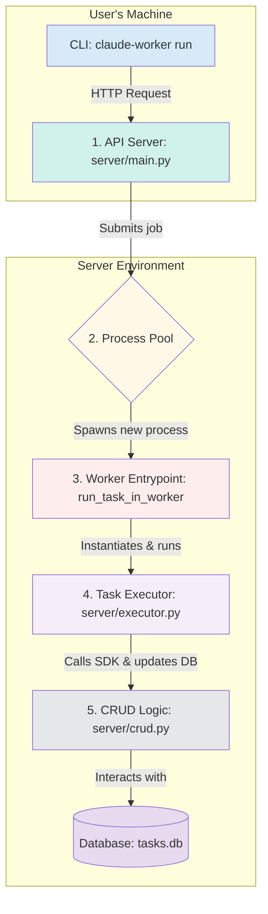

# Architecture Overview

Claude Worker is designed with a clean, decoupled architecture to ensure robustness, scalability, and maintainability. The core principle is the separation of concerns, where each component has a single, well-defined responsibility. This is explicitly stated in the "SOLE RESPONSIBILITY" docstrings found throughout the source code.

## High-Level Component Flow

A user's request flows through the system in a clear, linear path. This ensures that logic is not mixed and each component can be developed and tested in isolation.

### Key Components and Their Responsibilities

1.  **API Server (`server/main.py`)**
    *   **SOLE RESPONSIBILITY:** The system's central hub. It defines all API endpoints, manages the process pool, and orchestrates the server lifecycle.
    *   This module's only job is to receive HTTP requests, validate them, and hand off the work to the process pool. It contains no business logic about how a task is actually run.

2.  **Process Pool (`concurrent.futures.ProcessPoolExecutor`)**
    *   **SOLE RESPONSIBILITY:** Manage a pool of worker processes to execute tasks concurrently and in isolation.
    *   Defined in `server/main.py`, this is the component that provides scalability and crash protection. When a job is submitted to the pool, it is sent to a completely separate OS process.

3.  **Worker Entrypoint (`run_task_in_worker`)**
    *   **SOLE RESPONSIBILITY:** A simple, top-level function that serves as the entry point for a new worker process.
    *   Its only job is to instantiate the `TaskExecutor` and start its `run` method. It must be a top-level function so it can be "pickled" and sent to another process.

4.  **Task Executor (`server/executor.py`)**
    *   **SOLE RESPONSIBILITY:** Encapsulates the logic for running a single agentic task using the Claude Code SDK.
    *   This is where the core "work" happens. The `TaskExecutor` class interacts with the `claude-code-sdk`, processes the stream of messages, and handles success or failure states for a single task.

5.  **CRUD Logic (`server/crud.py`)**
    *   **SOLE RESPONSIBILITY:** Contains all database Create, Read, Update, Delete (CRUD) operations.
    *   This module is the only part of the application that writes `SQL` (via the `SQLModel` ORM). All functions here are pure and stateless, simply accepting a database session and data, ensuring that database logic is centralized and easy to manage.

This clean separation is a core architectural feature that makes the system robust. A bug in the `TaskExecutor` will crash a single worker process but will not affect the API Server or other running tasks. This design also makes it easier for new developers to understand the codebase, as they can focus on one component's responsibility at a time.